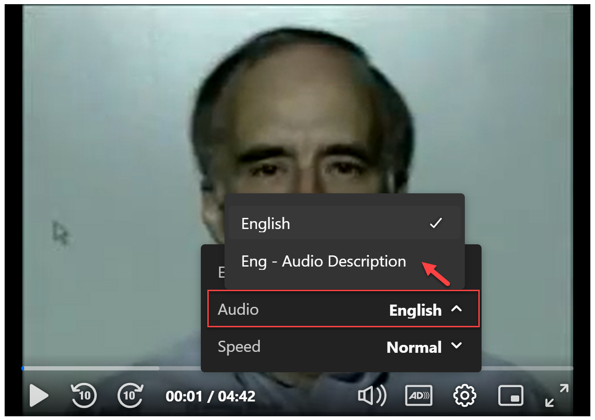

# Adding audio tracks to an entry (including Standard Audio Description)
The Kaltura player supports multiple audio tracks on an entry, including Standard Audio Description tracks, so that viewers of a single video will have the ability to easily switch between audio tracks to listen in the desired language.  

## Reference
Before we jump in, it's important to know how the Kaltura player handles separate audio tracks.  For a standard uploaded video, the audio is typically just embedded in the video itself and the player will just source the audio from the video.  In scenarios where you'd like to offer multiple audio tracks, Kaltura can extract all the tracks available from a video IF the video contains multiple tracks.  For situations where that's not the case and you'd like to add separate tracks, then we can manually do that in Kaltura, or use the API to perform this task.  The key point is that whenever there is at least one available separate audio track, then the Kaltura player will ignore the audio embedded in the video and use the available audio track(s) to source the audio.  So anytime you offer an additional audio track (additional language, or Standard AD, etc) then you MUST ensure that the original audio is also available as a separate track.  If you were to add a track, like another language track, but omit adding the original audio separately, then the player would only offer the additional track but not the original audio.

## Examples
Let's take a look at how we can use the Kaltura API to add additional audio tracks for a given entry.
### Workflow for adding a Standard Audio Description Track
1. Before we task ourselves with adding the Standard AD track, we need to make sure that we also have the original audio track available so that when the AD track is there, the player will give it as an option along with the original track (and any others that might exist, or be added).
If the original audio track is still embedded in the video, and not available as a standalone audio track, then we can force Kaltura to convert it using the [flavorAsset.convert() API call](https://developer.kaltura.com/api-docs/service/flavorAsset/action/convert).  For this, you'll need the entryId of the video, and then the flavorParamsId of the audio track flavor you are generating.  For our example, the video is in English, so we're going to force-generate the English audio track.  In the account we're using, the English Audio flavorParamsId is 10879003.  To find your specific English Audio flavorParamsId, you can look in the KMC in the Transcoding section, pick any VOD profile, and scroll down the list to find English Audio (this is also where you can find the flavorParamsId for the Audio Description track, which we'll need in the next step). 

Example code snippet (PHP) for forcing the generation of the original English audio track:
```php
$entryId = "1_a5fr1fzo";
$flavorParamsId = 10879003;
$priority = 0;

try {
    $result = $client->flavorAsset->convert($entryId, $flavorParamsId, $priority);
    var_dump($result);
} catch (Exception $e) {
    echo $e->getMessage();
}
```
Once the transcoding finishes, you should have the standalone English Audio track:


2. Now that we have the original audio track, then we can go about adding the Audio Description track.  When adding flavors (including AD tracks), we have to create the flavorAsset (as a container) before we can add the actual file into it.  We'll use the [flavorAsset.add() API call for this](https://developer.kaltura.com/api-docs/service/flavorAsset/action/add).  We'll need to specify the entryId we are adding the flavor for, the flavorParamsId for the Audio Description flavor (see above reference for the flavorParams list from KMC), the language, and the desired track label.
Example code snippet (PHP) for adding the Audio Description flavorAsset:
```php
$entryId = "1_a5fr1fzo";
$flavorAsset = new KalturaFlavorAsset();
$flavorAsset->flavorParamsId = 2609422;
$flavorAsset->label = "Eng - Audio Description";
$flavorAsset->language = "English";

try {
    $result = $client->flavorAsset->add($entryId, $flavorAsset);
    var_dump($result);
} catch (Exception $e) {
    echo $e->getMessage();
}
```
The API response will look something like this:
```json
{
  "id": "1_bdbu5pfp",
  "entryId": "1_a5fr1fzo",
  "partnerId": 5332512,
  "size": 0,
  "tags": "mobile,web,mbr,iphone,audio_only,alt_audio,audio_description",
  "createdAt": 1728659449,
  "updatedAt": 1728659449,
  "sizeInBytes": 0,
  "flavorParamsId": 2609422,
  "width": 0,
  "height": 0,
  "bitrate": 64,
  "frameRate": 0,
  "isOriginal": false,
  "isWeb": true,
  "containerFormat": "mp4",
  "videoCodecId": "",
  "status": 0,
  "language": "English",
  "label": "Eng - Audio Description",
  "isDefault": false,
  "objectType": "KalturaFlavorAsset"
}
```
We will use the 'id' for this newly created flavorAsset container in the next step to add the actual AD file to the container.

3. So at this point we have the original audio track as standalone as well as a container to hold the AD track.  Let's add the AD file to the container.  We'll use the [flavorAsset.setContent() API call](https://developer.kaltura.com/api-docs/service/flavorAsset/action/setContent) to do so.  There are multiple options of how to ingest the file, but we'll look at two options: uploadTokens and urlResources.  For more information on using uploadTokens to upload content to Kaltura, see https://github.com/Kaltura-SolutionsEngineering/Kaltura-API-scripts-and-workflows/tree/main/Uploading%20Assets%20via%20uploadTokens.
   - Example code snippet (PHP) for setting the Audio Description file to the flavorAsset using an upload token resource:
   ```php
   $id = "1_bdbu5pfp";
   $contentResource = new KalturaUploadedFileTokenResource();
   $contentResource->token = "1_6754447cf6bf7fc8f503a22cfde2489a";
   
   try {
       $result = $client->flavorAsset->setContent($id, $contentResource);
       var_dump($result);
   } catch (Exception $e) {
       echo $e->getMessage();
   }
   ```
   - Example code snippet (PHP) for setting the Audio Description file to the flavorAsset using a publicly hosted url for the file:
   ```php
   $id = "1_bdbu5pfp";
   $contentResource = new KalturaUrlResource();
   $contentResource->url = "https://some-valid-file-url.com";
   
   try {
       $result = $client->flavorAsset->setContent($id, $contentResource);
       var_dump($result);
   } catch (Exception $e) {
       echo $e->getMessage();
   }
   ```
These are just two options for uploading the file, though there are also others.  Once we've used the flavorAsset.setContent() API to set the AD file to the flavorAsset container we previously created, then we'll have both the original audio track, as well as the AD track:

And in the player, the viewer will see the Standard AD track, along with the original audio as available audio track options:


## Wrapping Up
Hopefully this guide and examples have given you direction on how to programmatically add additional audio tracks (including Standard AD) to an entry.

## Caveats/Notes
Remember that when using separate audio tracks, then you will always need to ensure that you also have the original audio available as a separate track (not just embedded in the video) so that the Kaltura player will see all the available audio tracks that it should offer the viewer during playback.

